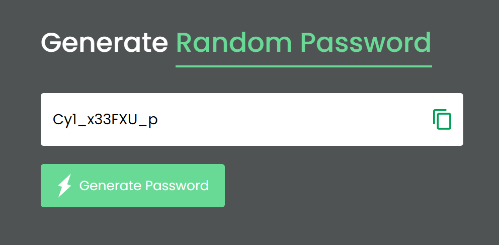

# Random Password Generator
This simple HTML and JavaScript code creates a web page that allows users to generate random passwords. The generated password includes a mix of uppercase letters, lowercase letters, numbers, and a special symbol. Users can also copy the generated password to their clipboard.

## Introduction
This web page provides a straightforward interface for generating strong and random passwords. It uses HTML for the structure, CSS for styling, and JavaScript for the password generation logic.

## Features
Random Password Generation: The script generates a random password with a predefined length (default: 12 characters) containing a mix of uppercase letters, lowercase letters, numbers, and a special symbol.

Copy to Clipboard: Users can easily copy the generated password to their clipboard by clicking the "Copy" button.

## Usage
- Open the HTML file (index.html) in a web browser.
- Click the "Generate Password" button to create a random password.
- The generated password will be displayed in the input field.
- Click the "Copy" button to copy the password to your clipboard.

## Image
